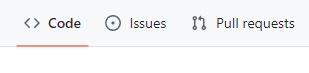

# 👷‍♀️ Contribuciones

> Las contribuciones son siempre bienvenidas.

Si deseas mejorar este proyecto o agregar nuevas funcionalidades, no dudés en abrir un **Issue** o enviar un **Pull Request**. Podés encontrar estas opciones en la esquina superior izquierda, justo debajo del nombre del repositorio.

- **💡 Issue**: Si queres reportar un error, sugerir una mejora o discutir una idea. Usalo para iniciar una conversación sobre cambios en el proyecto.

- **🔄 Pull Request**: Si realizaste cambios específicos en el código y queres compartirlo andá por aquí. Permite revisar, discutir y, si es aprobado, integrar esos cambios al proyecto.

> Tené en cuenta que tenemos un [Código de conducta](CODE_OF_CONDUCT.md) y que toda actividad en pyeph se rige por él. Leelo antes de contribuir, ya que ser parte de esta comunidad significa que acepta cumplirlo. Gracias.
